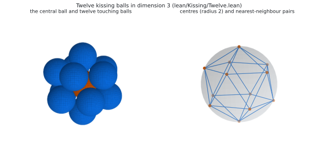
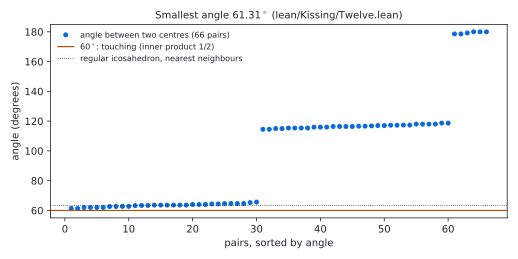
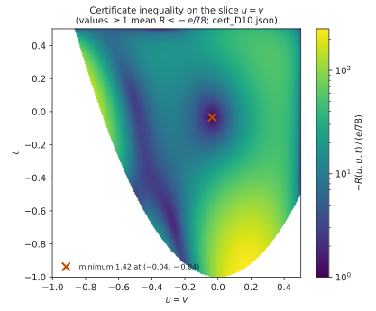
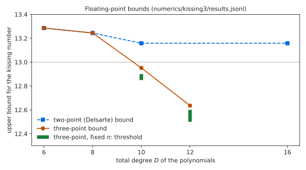

# The kissing number in dimension 3: a Lean 4 formalisation with a three-point certificate

[](https://doi.org/10.5281/zenodo.23100212)

Status: **Lean 4 formalisation, not peer reviewed.** Prepared 2026-10-02. **Produced by AI models** under the direction
of the repository owner; see [`AI_DISCLOSURE.md`](AI_DISCLOSURE.md).

> [!IMPORTANT]
> This repository contains an AI-produced **warrant**: a machine-checked Lean proof that no human has digested. The
> theorem itself is classical (Schütte and van der Waerden, 1953). The Lean development, the certificate and their
> correspondence with the stated theorem have not been checked by a human expert. We welcome a human review, and
> credit for a readable treatment belongs to whoever writes one. Questions, checks and corrections:
> [GitHub issues](https://github.com/alejandrozarco/kissing-number-3/issues).

Archived on Zenodo: [10.5281/zenodo.23100212](https://doi.org/10.5281/zenodo.23100212) (all versions).
Cite with `CITATION.cff`.

The kissing number $`\kappa(d)`$ is the largest number of non-overlapping unit balls in $`\mathbb{R}^d`$ that touch a
common unit ball. `lean/Kissing/Statement.lean` states, and the Lean kernel checks in `lean/Kissing/Solution.lean`:

```math
\kappa(3) = 12 .
```

The lower bound uses twelve explicit points with rational coordinates. The upper bound uses an exact three-point
semidefinite certificate in the sense of Bachoc and Vallentin for thirteen points, checked by `decide +kernel`.

## The statement

```lean
abbrev E (d : ℕ) := EuclideanSpace ℝ (Fin d)

def IsKissing {d : ℕ} (S : Set (E d)) : Prop :=
  (∀ x ∈ S, ‖x‖ = 2) ∧ ∀ x ∈ S, ∀ y ∈ S, x ≠ y → 2 ≤ dist x y

noncomputable def kissingNumber (d : ℕ) : ℕ∞ :=
  ⨆ (S : Set (E d)) (_ : IsKissing S), S.encard

theorem exists_isKissing_encard_eq_twelve : ∃ S : Set (E 3), IsKissing S ∧ S.encard = 12
theorem encard_le_twelve_of_isKissing (S : Set (E 3)) (hS : IsKissing S) : S.encard ≤ 12
theorem kissingNumber_three : kissingNumber 3 = 12
```

`IsKissing S` says that the points of `S` are centres of unit balls that touch the unit ball at the origin (distance
2) and do not overlap each other (pairwise distance at least 2). Sets may be infinite; sizes are counted in `ℕ∞`.
Three further theorems test the definition: two opposite balls form an arrangement, two balls $`30^\circ`$ apart do
not, and a ball at distance 3 does not. [`lean/STATEMENT.md`](lean/STATEMENT.md) explains every line.

Checks recorded in [`verification/`](verification/):
- Comparator: the six theorems of `lean/comparator.json` have the statements of `lean/Kissing/Statement.lean`, use only
  the axioms `propext`, `Quot.sound`, `Classical.choice`, and are accepted by the Lean kernel.
- `#print axioms` for all six: `[propext, Classical.choice, Quot.sound]`.
- A clean build of every module, one at a time from a fresh copy, with wall time and peak memory (table below).

The files contain no `sorry` outside `Statement.lean` and no `native_decide`.

## The argument

Any arrangement with more than 12 balls contains 13. Halving their centres gives unit vectors
$`x_1, \dots, x_{13}`$ with $`\langle x_i, x_j \rangle \le 1/2`$ for $`i \ne j`$. For three unit vectors write
$`(u, v, t)`$ for their pairwise inner products, and let $`\Delta`$ be the set of such triples with
$`u, v, t \le 1/2`$. The certificate consists of positive definite matrices $`F_0, \dots, F_5`$ of sizes 6 to 1. With
the Bachoc–Vallentin matrices $`S_k`$ and

```math
s(u,v,t) = \sum_{k=0}^{5} \langle F_k, S_k(u,v,t) \rangle ,
\qquad
R(u,v,t) = 11\, s(u,v,t) + s(u,u,1) + s(v,v,1) + s(t,t,1) + \frac{1}{12}\, s(1,1,1),
```

it contains a sum-of-squares identity showing

```math
R(u,v,t) \le -\frac{1}{32 \cdot 78} \quad \text{on } \Delta .
```

Summing over all ordered triples of distinct points and using the positivity of $`\sum_{i,j,l} S_k`$ (Bachoc–Vallentin)
gives $`1/32 \le 0`$, a contradiction. The polynomials have total degree 10. The sum-of-squares part uses the
multipliers $`1`$, $`1+x`$, $`1-2x`$, $`(1+x)(1-2x)`$ for $`x \in \{u, v, t\}`$ and the Gram determinant
$`1 + 2uvt - u^2 - v^2 - t^2`$, with Gram matrices of sizes 56, 35 (nine times) and 20.

| Lean module | content |
|---|---|
| `Kissing/Bound.lean` | the three-point bound, with the inner products restricted by an arbitrary condition |
| `Kissing/CertK.lean` | the exact certificate checker for $`\Delta`$ and its soundness theorem |
| `Kissing/Cert/` | the certificate data and its `decide +kernel` checks, one module per block |
| `Kissing/Twelve.lean` | the twelve points: rational, norm exactly 2, pairwise squared distance at least $`4.16`$ |
| `Kissing/Solution.lean` | the statements of `Statement.lean`, with proofs |

The certificate was found in floating point (`numerics/kissing3/k3.py`), rounded to exact rationals with denominators
dividing $`2^{25} \cdot 78`$ (`numerics/kissing3/round_k3.py`; the Lean encoding uses the common denominator
$`2^{53} \cdot 78`$), and checked in exact
arithmetic by an independent script (`numerics/kissing3/check_cert_k3.py`) before the Lean check.

## Figures

Regenerate with `python3 figures/make_figures.py` (matplotlib 3.9.4, numpy); every figure is computed from repository
files only.

<picture>
  <source media="(prefers-color-scheme: dark)" srcset="figures/configuration_dark.svg">
  
</picture>

The twelve balls of the lower bound (`lean/Kissing/Twelve.lean`). Right: their centres, joined for the 30 pairs at the
smallest angles, which form the edges of an icosahedron.

<picture>
  <source media="(prefers-color-scheme: dark)" srcset="figures/angles_dark.svg">
  
</picture>

The 66 angles between the twelve centres seen from the origin. Two balls touching the central ball overlap exactly
when their angle is below $`60^\circ`$; the smallest angle is above $`61.31^\circ`$.

<picture>
  <source media="(prefers-color-scheme: dark)" srcset="figures/certificate_dark.svg">
  
</picture>

The certificate inequality $`R \le -e/78`$ with $`e = 1/32`$, evaluated in floating point from `cert_D10.json` on the
slice $`u = v`$ of the region $`\Delta`$ (white: triples that are not inner products of unit vectors). The Lean check
covers all of $`\Delta`$ exactly.

<picture>
  <source media="(prefers-color-scheme: dark)" srcset="figures/bounds_dark.svg">
  
</picture>

Floating-point values from `numerics/kissing3/results.jsonl` (not certified): the two-point (Delsarte) bound stays
above 13.158; the three-point bound falls below 13 from degree 10; the fixed-$`n`$ problem used here is feasible for
$`n = 13`$ from degree 10 (bars: the bracket of its threshold in $`n`$).

## Contents

| path | content |
|---|---|
| `lean/` | the Lean package: statement, proof, certificate modules, emitter (`gen/`), `regen.sh`, Comparator config, build scripts |
| `lean/STATEMENT.md` | the statement in plain English |
| `numerics/kissing3/` | SDP formulation, floating-point solutions, exact rounding, exact checker, the certificate `cert_D10.json` |
| `verification/` | records of the clean build, Comparator, axioms and the upstream-text scan |
| `figures/` | the figure and `make_figures.py` |
| `formalization.yaml` | metadata (mathlib-initiative format v0.4) |
| `AI_DISCLOSURE.md` | how AI models were used, what is checked and what is trusted |
| `LICENSE`, `CITATION.cff` | licence (Apache-2.0) and citation metadata |
| `MANIFEST.sha256` | sha256 of every file |

## Reproduce

Lean (toolchain `leanprover/lean4:v4.34.1`, Mathlib `d13f23b`, both pinned):

```sh
cd lean
./regen.sh                    # regenerates ThomsonGen/*.lean from upstream; checks the eight imported ones by sha256
lake exe cache get
bash scripts/build_test.sh    # every module one at a time (or: lake build, if the machine has enough memory)
lake env lean Kissing/Axioms.lean
```

`lean/scripts/run_comparator.sh` runs [Comparator](https://github.com/leanprover/comparator) (pins in the script).
`lake build` may compile several modules in parallel; the certificate modules form one import chain to limit this.

Certificate (Python 3, `python-flint`, `numpy`; `cvxpy` with Clarabel only to re-solve):

```sh
cd numerics/kissing3
python3 check_cert_k3.py cert_D10.json                                    # exact check (about 25 s)
python3 round_k3.py sol/fixn_D10_n13_mu0.5.npz cert.json 24               # re-round the float solution
python3 ../../lean/gen/emit_k3.py cert_D10.json --outdir /tmp/Cert       # re-emit the Lean data
./run.sh fixn 10 13 && ./run.sh mu 10 13 0.5                              # re-solve (float)
```

## Clean build

Every module compiled one at a time (`lean/scripts/build_test.sh`, `lean -j1`) from a fresh copy of `lean/`
after `regen.sh` and `lake exe cache get`, on Linux x86_64 (`verification/build_test.tsv`). Wall time includes
loading Mathlib for each module.

| module | wall (s) | peak RSS (GB) |
|---|---:|---:|
| `Kissing.Statement` | 307 | 6.3 |
| `ThomsonGen.Preamble` | 47 | 6.4 |
| `ThomsonGen.ThreePoint` | 49 | 6.5 |
| `ThomsonGen.Kron` | 31 | 6.4 |
| `ThomsonGen.Cert1` | 21 | 6.4 |
| `ThomsonGen.Cert3` | 40 | 6.5 |
| `ThomsonGen.Case1Stat` | 20 | 6.4 |
| `ThomsonGen.M2` | 96 | 8.5 |
| `ThomsonGen.CertF` | 30 | 6.4 |
| `Kissing.Bound` | 22 | 6.4 |
| `Kissing.CertK` | 25 | 6.4 |
| `Kissing.Cert.Data` | 30 | 6.4 |
| `Kissing.Cert.ChkF` | 34 | 6.5 |
| `Kissing.Cert.ChkS0` | 86 | 8.8 |
| `Kissing.Cert.ChkS1` | 37 | 7.1 |
| `Kissing.Cert.ChkS2` | 37 | 7.1 |
| `Kissing.Cert.ChkS3` | 26 | 7.1 |
| `Kissing.Cert.ChkS4` | 26 | 7.1 |
| `Kissing.Cert.ChkS5` | 33 | 7.1 |
| `Kissing.Cert.ChkS6` | 37 | 7.1 |
| `Kissing.Cert.ChkS7` | 37 | 7.1 |
| `Kissing.Cert.ChkS8` | 27 | 7.1 |
| `Kissing.Cert.ChkS9` | 36 | 7.1 |
| `Kissing.Cert.ChkS10` | 22 | 6.5 |
| `Kissing.Cert.ChkId` | 20 | 6.4 |
| `Kissing.Cert.OkF` | 16 | 6.4 |
| `Kissing.Cert.OkS0` | 33 | 7.4 |
| `Kissing.Cert.OkS1` | 21 | 6.7 |
| `Kissing.Cert.OkS2` | 23 | 6.7 |
| `Kissing.Cert.OkS3` | 27 | 6.7 |
| `Kissing.Cert.OkS4` | 24 | 6.7 |
| `Kissing.Cert.OkS5` | 23 | 6.7 |
| `Kissing.Cert.OkS6` | 27 | 6.7 |
| `Kissing.Cert.OkS7` | 19 | 6.7 |
| `Kissing.Cert.OkS8` | 22 | 6.7 |
| `Kissing.Cert.OkS9` | 27 | 6.7 |
| `Kissing.Cert.OkS10` | 22 | 6.4 |
| `Kissing.Cert.Check` | 20 | 6.4 |
| `Kissing.Twelve` | 25 | 6.4 |
| `Kissing.Solution` | 18 | 6.4 |
| `Kissing.Axioms` | 13 | 6.4 |

Total 26 min; largest peak 8.8 GB (`Kissing.Cert.ChkS0`).

## Upstream code and related work

- The three-point machinery (Bachoc–Vallentin positivity on $`S^2`$, the three-point identity, the integer certificate
  format with the Kronecker check) is from the Lean formalisation of the Coulomb Thomson problem,
  [huwngtran/thomson-n7-lean](https://github.com/huwngtran/thomson-n7-lean) at commit `25f2fa5`. That repository has no
  licence file, so its code is not stored here: `lean/regen.sh` downloads the pinned file, regenerates the
  upstream-derived `ThomsonGen/` modules, and checks the eight that are imported against
  `lean/ThomsonGen/scripts/generated.sha256`. Declarations adapted from it name their
  upstream source in a comment after the imports; `lean/ThomsonGen/scripts/scan_upstream.py` checks this
  (`verification/scan_upstream.txt`: 0 verbatim declarations, all near-copies attributed).
- The splitter `split.py`, the scanner, and `lean/gen/cert3_util.py` are from
  [alejandrozarco/thomson-n7-log](https://github.com/alejandrozarco/thomson-n7-log).
- K. Schütte and B. L. van der Waerden, *Das Problem der dreizehn Kugeln*, Math. Ann. 125 (1953); later proofs by
  J. Leech (1956), K. Anstreicher (2004), O. R. Musin (2006) and others.
- C. Bachoc and F. Vallentin, *New upper bounds for kissing numbers from semidefinite programming*, J. Amer. Math.
  Soc. 21 (2008); H. D. Mittelmann and F. Vallentin, *High-accuracy semidefinite programming bounds for kissing
  numbers*, Experiment. Math. 19 (2010).
- Related formal and exact work found on 2026-10-02: lattice kissing numbers in Lean (TauCetiProject/TauCeti);
  asymptotic bounds in Lean (Vilin97/lean-pool); a Lean development on kissing configurations in dimension 24;
  an exact rational three-point certificate for dimension 11 checked in Julia and Python
  (ruturajr-raval/kissing-number-11-certified-upper-bound). We did not find a formal proof of $`\kappa(3) = 12`$;
  please tell us if one exists.

## Licence

Apache License 2.0 ([`LICENSE`](LICENSE)), copyright 2026 the repository owner (alejandrozarco). Not covered: the
upstream modules that `lean/regen.sh` regenerates (not stored here), the upstream material in the adapted
declarations named in the files, and the upstream material in `lean/scripts/run_comparator.sh`.
